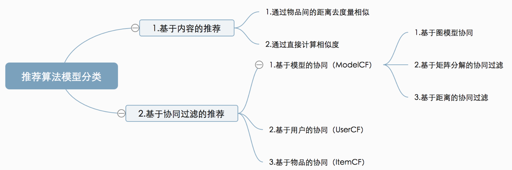

# 搜索引擎与推荐系统有什么区别？

搜索引擎：实现人找信息，eg.百度搜索...
推荐系统：实现信息找人，eg.亚马逊的图书推荐列表...

# 推荐的意义
消费者如何不经意间发现自己喜欢的商品，生产者以及平台方如何让自己的商品脱颖而出，增加销量，挖掘商品’长尾’… 推荐系统就是为了解决这些问题的。
简单来说，对于消费者而言，他们喜欢用2个小时去看一部感兴趣的电影，却不愿意花20分钟去挑选，这就是个性化推荐系统存在的意义。

# 算法分类
在算法模型上大体可以分：基于内容的推荐、基于协同过滤的推荐。

